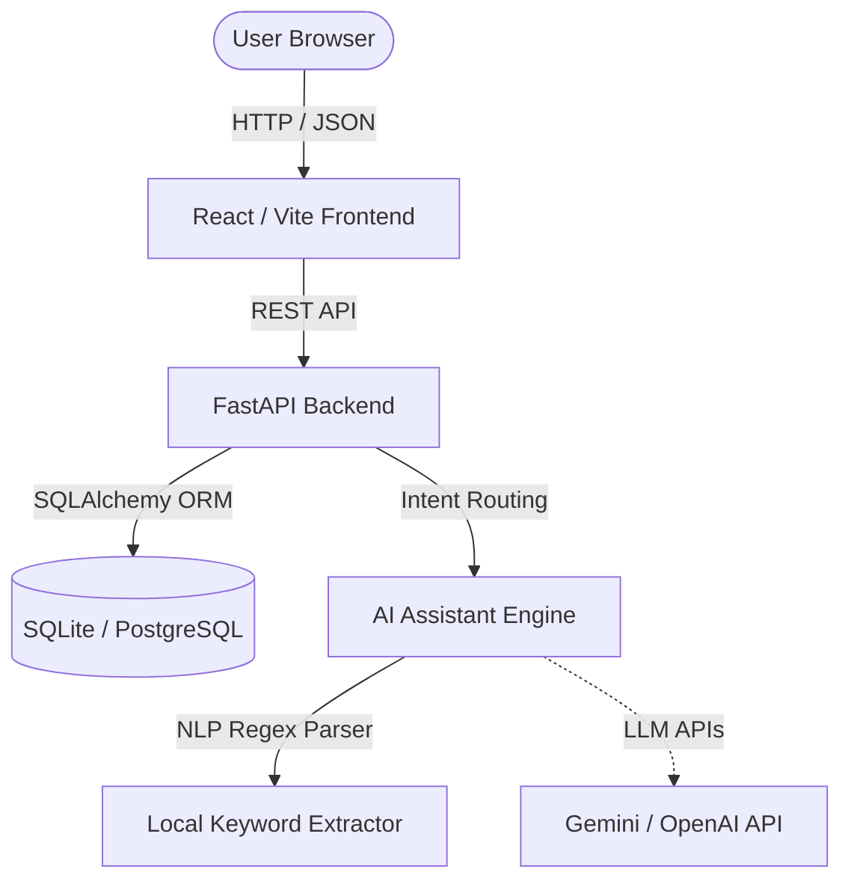

# Ethara Seat Allocation & Project Mapping System

A clean, production-ready, and highly scalable workspace management system built for Ethara. The platform enables managing office desk seats, allocating new joiners adjacent to their project team members, viewing interactive floor plans, query logging with an AI assistant, and bulk-importing employee data.

---

## 🏗️ System Architecture



### Core Business Rules
- **One employee, one active seat:** An employee can have at most one active seat allocation. Historic allocations are saved for audits.
- **One seat, one active employee:** A seat can host at most one active employee. Released seats automatically become `Available`.
- **Adjacency heuristic:** Allocations prioritize same bay → same zone → same floor → other floors.
- **Concurrency controls:** The allocation engine uses SELECT FOR UPDATE row-level locking to avoid race conditions.

---

## 🚀 Getting Started

### Local Development Setup

#### 1. Backend Service
```bash
cd backend
python -m venv .venv
.venv\Scripts\activate   # On Windows
# source .venv/bin/activate  # On macOS/Linux

pip install -r requirements.txt
python seed.py
uvicorn app.main:app --reload
```
API docs are available at `http://localhost:8000/docs` (interactive custom dark Swagger).

#### 2. Frontend Service
```bash
cd frontend
npm install
npm run dev
```
Open `http://localhost:5173` in your browser.

---

## 📋 API Endpoint Reference

| Category | Method | Path | Description |
|---|---|---|---|
| **Employees** | `POST` | `/employees/` | Create a new employee |
| | `GET` | `/employees/` | List and search employees by name/email/code |
| | `GET` | `/employees/{id}` | Get employee details |
| | `PUT` | `/employees/{id}` | Update employee profile |
| | `DELETE`| `/employees/{id}` | Delete employee and release active seat |
| | `POST` | `/employees/upload-csv` | Bulk import employees from CSV |
| **Projects** | `POST` | `/projects/` | Create a project |
| | `GET` | `/projects/` | List all projects |
| | `GET` | `/projects/{id}/employees` | List all employees on a project |
| **Seats** | `POST` | `/seats/` | Create a seat configuration |
| | `GET` | `/seats/` | List seats by floor/zone/status |
| | `GET` | `/seats/available` | Get all available seats |
| | `POST` | `/seats/allocate` | Allocate seat (manual or auto) |
| | `POST` | `/seats/release` | Release seat by employee ID (body param) |
| | `POST` | `/seats/release/{employee_id}` | Release seat by employee ID (path param) |
| | `GET` | `/seats/{id}/occupant` | Get employee occupying seat |
| | `POST` | `/seats/upload-csv` | Bulk import seat layouts from CSV |
| **Dashboard** | `GET` | `/dashboard/summary` | Aggregated office KPIs |
| | `GET` | `/dashboard/project-utilization` | Seat allocations per project |
| | `GET` | `/dashboard/floor-utilization` | Occupancy rates per floor |
| | `POST` | `/dashboard/seed` | Trigger scale seeding (5,000 employees) |
| **AI** | `POST` | `/ai/query` | Submit natural language query to chatbot |

---

## 🤖 AI Query Command Interface
The floating AI Assistant chatbot supports these natural language queries:
- **Seat Lookup:** `"Where is employee EMP-00002 seated?"`
- **Teammate Finder:** `"Who is sitting near Amit?"` or `"Who sits near me?"`
- **Floor Availability:** `"Show all available seats on Floor 3."`
- **Auto Seat Allocator:** `"Allocate a seat for a new employee joining today."`
- **Office Metrics:** `"Give me an office summary."`
- **Project Utilization:** `"How many seats are occupied for Project Indigo?"`
